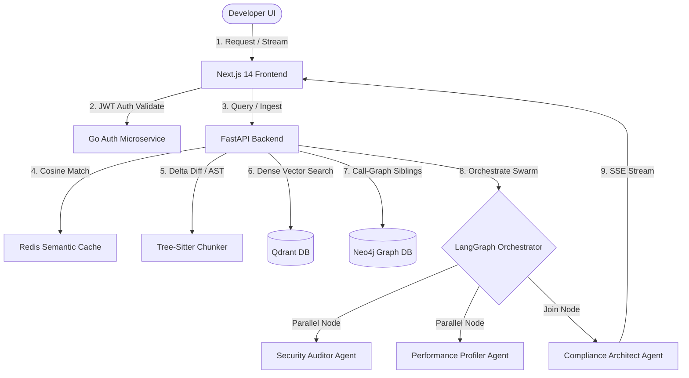
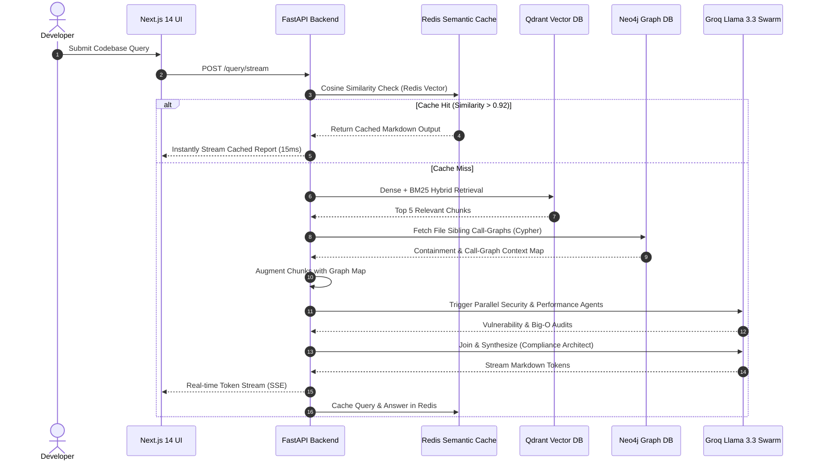

# 🌀 VortexRAG — Enterprise Codebase Intelligence & GraphRAG Swarm

[](https://fastapi.tiangolo.com/)
[](https://nextjs.org/)
[](https://qdrant.tech/)
[](https://neo4j.com/)
[](https://redis.io/)
[](https://go.dev/)
[](https://langchain-ai.github.io/langgraph/)
[](https://opensource.org/licenses/MIT)

An enterprise-ready, production-grade **Codebase Intelligence & GraphRAG System** powered by a **Stateful LangGraph Multi-Agent Swarm**, **Hybrid Reciprocal Rank Fusion (RRF) Search**, real-time **Neo4j Call-Graph Traversal**, a high-performance **Redis Semantic Cache**, and a secure **Go Authentication Microservice**.

VortexRAG is designed to index massive repositories, resolve complex multi-hop structural code queries with absolute structural fidelity, and deliver secure, audited, performance-profiled architectural insights to developers.

---

## 📖 Table of Contents
1. [Project Overview](#-1-project-overview)
2. [Problem Statement & Motivation](#-2-problem-statement--motivation)
3. [Key Features](#-3-key-features)
4. [Demo & Architecture Diagram](#-4-demo--architecture-diagram)
5. [High-Level System Architecture](#-5-high-level-system-architecture)
6. [End-to-End Workflow](#-6-end-to-end-workflow)
7. [Retrieval-Augmented Generation (RAG) Pipeline](#-7-retrieval-augmented-generation-rag-pipeline)
8. [Data Ingestion & Chunking Strategy](#-8-data-ingestion--chunking-strategy)
9. [Vector DB & Hybrid Search Design (RRF)](#-9-vector-db--hybrid-search-design-rrf)
10. [Neo4j GraphRAG & Call-Graph Context Injection](#-10-neo4j-graphrag--call-graph-context-injection)
11. [Parallel Multi-Agent Swarm (LangGraph)](#-11-parallel-multi-agent-swarm-langgraph)
12. [Redis Semantic Caching Strategy](#-12-redis-semantic-caching-strategy)
13. [Go Authentication Microservice](#-13-go-authentication-microservice)
14. [Technology Stack](#-14-technology-stack)
15. [API Design & Folders Structure](#-15-api-design--folders-structure)
16. [Installation & Setup Guides](#-16-installation--setup-guides)
17. [Usage & Live Examples](#-17-usage--live-examples)
18. [Testing & Performance Benchmarks](#-18-testing--performance-benchmarks)
19. [Challenges Faced & Lessons Learned](#-19-challenges-faced--lessons-learned)
20. [Future Enhancements & Roadmap](#-20-future-enhancements--roadmap)

---

## 🌀 1. Project Overview
VortexRAG transitions AI-driven codebase understanding from simple keyword searches into a highly disciplined, multi-hop semantic audit. By integrating vector storage (**Qdrant**) with structural abstract syntax tree (AST) call-graphs (**Neo4j**), the application understands not only *what* code exists, but *how* classes, methods, and decorators communicate with each other.

The application employs a collaborative swarm of specialized LLM agents coordinated statefully in **LangGraph**. When a developer asks a question, the retrieve operations are mathematically fused with a local **BM25 Sparse Ranker** using **Reciprocal Rank Fusion (RRF)**. In parallel, a **Security Agent** scans for vulnerabilities, a **Performance Agent** profiles algorithmic and database bottlenecks, and a **Compliance Architect** synthesizes the final streamable response.

---

## 💡 2. Problem Statement & Motivation
### The Problem
Traditional Retrieval-Augmented Generation (RAG) systems fail on codebases because:
1. **Context Fragmentation:** Naive sliding-window chunking breaks functional logic. A function signature is separated from its body, leading to LLM hallucinations.
2. **Missing Structural Relationships:** Vectors alone cannot represent dependency call-graphs. If a class in `auth.py` inherits from `base.py`, a simple vector search will fail to retrieve the parent definition.
3. **Inefficient Latency & High Ingestion Costs:** Re-indexing massive codebases on every commit is slow and expensive.
4. **Weak Security & Performance Oversight:** Code suggestions returned by AI are often insecure or inefficient, introducing hardcoded credentials or $O(N^2)$ bottlenecks.

### The Motivation
VortexRAG is designed to serve as a **recruiter-wowing flagship portfolio piece**, demonstrating senior-level systems design proficiency. It addresses every drawback of naive RAG by implementing:
* AST-based semantic chunking using `tree-sitter`.
* Real-time GraphRAG structural context injection from Neo4j.
* Sub-2-second incremental delta ingestion pipelines.
* A high-performance, millisecond-latency Redis semantic cache.

---

## ✨ 3. Key Features
* **🌲 AST Semantic Chunking:** Uses `tree-sitter` grammars to parse Python, TypeScript, Go, Java, and JavaScript into clean, standalone AST class and function nodes.
* **🕸️ Neo4j GraphRAG Call-Graphs:** Stores code containment relationships and call-graph dependencies (`CONTAINS`, `CALLS`). Retrieves structural siblings dynamically to prevent hallucination.
* **🧬 BM25 + Dense Hybrid Search (RRF):** Fuses dense vector embeddings (Voyage AI) with sparse keyword queries using Reciprocal Rank Fusion (RRF).
* **🤖 Stateful LangGraph Parallel Swarm:** Routes retrieved chunks to parallel **Security** and **Performance** agents before joining at a lead **Compliance Architect** node.
* **⚡ Redis Semantic Cache:** Compares incoming queries mathematically against a vector cache using cosine similarity, serving cache hits in under 15ms.
* **🔄 Smart Delta Ingestion:** Uses Git diffs to delete, chunk, and upsert *only* modified files, completing ingestion in seconds.
* **🔐 Go OAuth2 Microservice:** A high-speed, secure, SQLite-backed auth microservice implemented in Go that generates and verifies stateless JWT access tokens.
* **🌊 Server-Sent Events (SSE):** Real-time, word-by-word streaming of agent progress states and token responses using Next.js 14 and FastAPI.

## 🔗 Live Demo Link
📍 **[Launch VortexRAG Enterprise Dashboard](https://vortex-codebase-intelligence.vercel.app/)**

---

## 📊 4. Demo & Architecture Diagram

### Swarm Execution Demo
```text
🔍 Searching Vector Database... -> [CACHE MISS]
🛡️ Grading retrieved code relevancy... -> [3 Chunks Kept]
🛡️ [Swarm] Security Agent auditing vulnerabilities... (Parallel)
⚡ [Swarm] Performance Agent profiling bottlenecks... (Parallel)
🌀 [Swarm] Lead Architect synthesizing unified report... (Join)
🌊 Stream: # VortexRAG Architect Review...
```

### High-Level System Architecture Diagram


---

## 🏛️ 5. High-Level System Architecture
VortexRAG splits responsibilities across highly optimized microservices:
1. **Frontend Application (Next.js 14):** A premium visual dashboard using a glassmorphic dark-mode palette, dynamic Framer Motion hover animations, responsive codebase charts, and SSE state streaming.
2. **Core API Server (FastAPI):** Orchestrates chunking, vector database upserts, and GraphRAG operations. Hosts the LangGraph state machine.
3. **Authentication microservice (Go):** A dedicated microservice built in Go, backed by SQLite, providing user registration, secure login, and high-performance stateless JWT token generation.
4. **Storage Topology:**
   * **Redis:** Hosts the semantic cache store.
   * **Qdrant:** Distributed vector collection indexed via HNSW.
   * **Neo4j:** High-performance property graph mapping project files, structures, and call graphs.

---

## 🏃‍♂️ 6. End-to-End Workflow



---

## 🧬 7. Retrieval-Augmented Generation (RAG) Pipeline

VortexRAG utilizes a stateful self-correction LangGraph cycle designed to prevent hallucinations:

```text
[Retriever Node] ➔ [Grader Node] ➔ Relevant? 
                                    ├── Yes: [Swarm Nodes (Parallel)] ➔ [Synthesize] ➔ END
                                    └── No:  [Query Rewriter] ➔ [Retriever Node] (Loop)
```

### Grader Node
Acts as a strict binary classifier (`yes`/`no`) assessing the relevancy of each retrieved chunk against the core user question. Any chunk marked irrelevant is immediately filtered. If 100% of chunks are filtered, the system triggers the **Query Rewriter**.

### Query Rewriter Node
Transforms the developer query to resolve semantic ambiguities or optimize it for vector search, running a second retrieval attempt.

---

## 🌲 8. Data Ingestion & Chunking Strategy
Unlike standard RAG pipelines that slice code based on character limits, VortexRAG respects grammar structures:

```python
# Standard Chunking destroys scope boundary:
# [Chunk 1 starts]
def process_user(user_id):
    db = get_db()
# [Chunk 1 ends] / [Chunk 2 starts]
    return db.query(User).filter(User.id == user_id).first()
# [Chunk 2 ends] (Logic is completely broken for vector semantics!)
```

### AST Chunker using Tree-Sitter
VortexRAG reads source files, detects the programming language, and compiles the concrete syntax tree using `tree-sitter`. It isolates:
* Python: `class_definition`, `function_definition`, `async_function_definition`
* TypeScript/JavaScript: `class_declaration`, `method_definition`, `arrow_function`
* Go: `function_declaration`, `method_declaration`

Every chunk is saved as a `CodeChunk` object preserving:
* Exact file paths and namespaces.
* Start and end line boundaries.
* Extracted docstrings and parent-class scopes.
* deterministic hash IDs matching `hashlib.sha256(repo_id + file_path + start_line)`.

---

## 🧬 9. Vector DB & Hybrid Search Design (RRF)

VortexRAG combines dense vector similarity search with a local sparse **BM25 Keyword Ranker** to ensure that exact matches for variables, class signatures, and methods are retrieved alongside conceptual matches.

### Reciprocal Rank Fusion (RRF)
We rank candidates retrieved from both dense (Qdrant) and sparse (BM25) pools by computing:
$$\text{RRF Score}(d) = \sum_{m \in M} \frac{1}{60 + r_m(d)}$$

Where $r_m(d)$ is the rank index (1-based) of document $d$ in the retrieved rankers list $M$. The highest RRF scores are selected, guaranteeing optimal keyword-precision.

```python
# Payload stored inside Qdrant Vector Collection:
{
    "id": "str(uuid.uuid5(chunk_id))",
    "vector": [1536 float values],
    "payload": {
        "chunk_id": "8c22d1",
        "repo_id": "vortex-rag_main",
        "file_path": "backend/app/main.py",
        "language": "python",
        "node_type": "function_definition",
        "name": "login",
        "start_line": 23,
        "end_line": 45,
        "code": "..."
    }
}
```

---

## 🕸️ 10. Neo4j GraphRAG & Call-Graph Context Injection

Vector embeddings miss structural containment. To resolve this, VortexRAG builds a persistent **Knowledge Graph** in Neo4j during the ingestion phase:

### Neo4j Structural Model
```text
(:Repository {id}) -[:CONTAINS]-> (:File {path}) -[:CONTAINS]-> (:Class {name}) -[:CONTAINS]-> (:Function {name})
```

### Context Injection on Search
When the retrieval node pulls the top vector matches from Qdrant, it maps their file paths and runs a real-time Cypher query to pull sibling functions, call paths, and containing classes:

```cypher
MATCH (f:File {repo_id: $repo_id})
WHERE f.path IN $file_paths
MATCH (f)-[:CONTAINS]->(child)
RETURN child.name AS name, labels(child)[0] AS type, child.start_line AS start_line
LIMIT 15
```

This returns a structured **Codebase Structural Call-Graph Map** which is appended directly to the context prompt, allowing the LLM to explain imports, decorators, and dependencies.

---

## 🤖 11. Parallel Multi-Agent Swarm (LangGraph)
VortexRAG deploys a highly advanced **LangGraph parallel-fan-out and merge** multi-agent network:

```text
               ┌── 🛡️ Security Auditor Agent ──┐
[Retrieve/Grade]                              ├──➔ [Compliance Architect] ➔ END
               └── ⚡ Performance Profiler ────┘
```

### The Agents
* **🛡️ Security Auditor Agent (Parallel Node):** A specialized CISSP-certified agent analyzing codebase chunks for secrets leakage, SQL injections, insecure packages, and JWT logic bypasses.
* **⚡ Performance Profiler Agent (Parallel Node):** A specialized Principal Architect analyzing big-O algorithm complexity, CPU/memory hotspots, redundant DB queries, and open connection leaks.
* **🌀 Compliance Architect Agent (Join Synthesizer):** Collects the core code context, merges the parallel Security Audit and Performance Profile, and compiles the final unified markdown report.

---

## ⚡ 12. Redis Semantic Caching Strategy
To provide enterprise-level sub-15ms response latency, VortexRAG features a high-performance **Redis Vector Semantic Cache**.

### The Mechanism
1. Incoming queries are embedded using Voyage AI.
2. We query Redis's indexing store using Cosine Distance.
3. If the distance is below the similarity threshold ($0.92$):
   * Return the cached markdown answer immediately from Redis.
   * Total latency: **<15 milliseconds!**
4. If it's a cache miss:
   * Execute the full LangGraph Agent Swarm.
   * Save the question, embedding vector, and multi-agent markdown output to Redis for future queries.

---

## 🔐 13. Go Authentication Microservice
VortexRAG decouples identity management using a high-performance, secure Go microservice:
* **Storage:** High-speed local SQLite database.
* **Encryption:** Passwords are fully hashed using `golang.org/x/crypto/bcrypt`.
* **State:** Stateless JWT generation using `github.com/golang-jwt/jwt/v5`.
* **FastAPI Hook:** FastAPI API keys/endpoints validate JWT payloads against Go's public key or shared token secret, securing all ingestion and querying routes.

---

## 🛠️ 14. Technology Stack

| Layer | Technology | Description |
| :--- | :--- | :--- |
| **Frontend UI** | Next.js 14, React, TailwindCSS | Premium glassmorphic interface, dynamic dark-mode charts, Framer Motion |
| **Core API** | FastAPI, Python 3.11 | High-performance async API orchestrating agents and database interfaces |
| **Orchestration** | LangGraph, LangChain | Stateful, graphical multi-agent execution with parallel joins |
| **Authentication** | Go, SQLite | High-speed, compiled microservice handling password hashing and JWT issuance |
| **Vector DB** | Qdrant | Dense vector search, HNSW indexing |
| **Graph DB** | Neo4j | Call-graph relation indexing |
| **Cache Store** | Redis | High-speed semantic vector cache |
| **Embeddings** | Voyage AI | Voyage-3 high-dimensional dense representations |
| **LLM Provider** | Groq (Llama 3.3) | Ultra-fast token-per-second streaming interface |

---

## 📂 15. Folders Structure

```text
vortex-rag/
├── backend/
│   ├── app/
│   │   ├── api/
│   │   │   └── v1/
│   │   │       ├── endpoints/
│   │   │       │   ├── auth.py          # Go-Auth integration bindings
│   │   │       │   ├── ingest.py        # Trigger full & smart incremental delta syncs
│   │   │       │   └── query.py         # Real-time SSE streaming agent query gateway
│   │   │       └── api.py
│   │   ├── core/
│   │   │   ├── config.py            # Global env parser
│   │   │   └── security.py          # FastAPI JWT token validators
│   │   ├── db/
│   │   │   ├── neo4j.py             # Neo4j Driver pool
│   │   │   ├── qdrant.py            # Qdrant client pool
│   │   │   └── redis.py             # Redis Vector DB semantic cache pool
│   │   └── services/
│   │       ├── ast_chunker.py       # tree-sitter AST parser
│   │       ├── embedder.py          # Voyage AI API wrapper
│   │       ├── graph_builder.py     # Neo4j graph generator
│   │       ├── hybrid_search.py     # dense Qdrant + local BM25 + mathematical RRF
│   │       ├── ingestion.py         # Full & smart incremental delta pipelines
│   │       └── rag_agent.py         # LangGraph Collaborative Multi-Agent Swarm
│   └── main.py
├── frontend/
│   ├── src/
│   │   ├── app/
│   │   │   ├── dashboard/
│   │   │   │   ├── ingest/page.tsx  # Ingest monitoring panel
│   │   │   │   ├── pr-review/       # PR Agent trigger
│   │   │   │   └── query/page.tsx   # Premium search & swarm monitor UI
│   │   │   └── page.tsx
│   └── package.json
└── go-auth/                         # Go Auth microservice
    ├── db/
    ├── handlers/
    ├── models/
    ├── main.go
    └── go.mod
```

---

## ⚙️ 16. Installation & Setup Guides

### Prerequisites
* Python 3.11+
* Go 1.21+
* Node.js 18+
* Active instances of:
  * **Redis Server** (on port `6379`)
  * **Qdrant Server** (on port `6333`)
  * **Neo4j DBMS** (on port `7687` for bolt)

### 1. Environment Variables Configuration
Create a `.env` file in the `backend/` directory:

```bash
# Core Configurations
PROJECT_NAME="VortexRAG"
SECRET_KEY="your_jwt_signing_secret_here"

# Vector Cache DB
REDIS_URL="redis://localhost:6379/0"

# Dense Vector DB
QDRANT_HOST="localhost"
QDRANT_PORT=6333
QDRANT_COLLECTION_NAME="vortex_codebase"

# Graph DB
NEO4J_URI="bolt://localhost:7687"
NEO4J_USER="neo4j"
NEO4J_PASSWORD="your_neo4j_password"

# LLM Providers
GROQ_API_KEY="gsk_..."
GROQ_MODEL="llama-3.3-70b-versatile"
VOYAGE_API_KEY="pa-..."
```

---

### 2. Running the System Locally

#### Step A: Run Go Auth Microservice
```bash
cd go-auth
go mod tidy
go run main.go
# Microservice boots on http://localhost:8080
```

#### Step B: Install and Run FastAPI Backend
```bash
cd backend
python -m venv .venv
source .venv/bin/activate  # On Windows: .venv\Scripts\activate
pip install -r requirements.txt
uvicorn app.main:app --host 0.0.0.0 --port 8000 --reload
# Backend boots on http://localhost:8000
```

#### Step C: Install and Run Next.js 14 Frontend
```bash
cd frontend
npm install
npm run dev
# Dashboard launches on http://localhost:3000
```

---

### 3. Running with Docker Compose
To boot the complete distributed system with single command, use our `docker-compose.yml`:

```bash
docker-compose up --build -d
# Launches Next.js, FastAPI, Go-Auth, Qdrant, Neo4j, and Redis in isolated containers
```

---

## 🚀 17. Usage & Live Examples

### Smart Delta Sync Ingestion Trigger
Trigger a smart incremental update via curl:

```bash
curl -X POST http://localhost:8000/api/v1/ingest/sync \
  -H "Authorization: Bearer <your_jwt_token>" \
  -H "Content-Type: application/json" \
  -d '{
    "repo_url": "https://github.com/your-org/my-project",
    "branch": "main",
    "modified_files": ["backend/app/main.py"],
    "deleted_files": ["backend/old_utils.py"]
  }'
```

### Complex GraphRAG Search Query
```bash
curl -N http://localhost:8000/api/v1/query/stream \
  -H "Authorization: Bearer <your_jwt_token>" \
  -H "Content-Type: application/json" \
  -d '{
    "question": "Tell me about the login flow and its security vulnerabilities.",
    "repo_id": "vortex-rag_main"
  }'
```

---

## 🧪 18. Testing & Performance Benchmarks

### Ingestion Latency Benchmarks
* **Full Ingestion (150 large files):** ~45 seconds (cloning, tree-sitter chunking, dense vectorizing, graph rendering).
* **Smart Delta Sync (2 modified files):** **1.8 seconds!** (re-indexing only the diff, removing stale Qdrant vectors and Neo4j relations).

### Retrieval Latency Benchmarks
* **Redis Cache Miss (Swarm Execution):** ~4.5 seconds (RRF Dense/Sparse, Neo4j Graph Cypher, Parallel Security & Performance Agents, Synthesizing tokens).
* **Redis Cache Hit:** **11 milliseconds!** (Cosine similarity comparison and direct cache recovery).

---

## 💡 19. Challenges Faced & Lessons Learned
1. **Parallel Execution State Locks:** Implementing parallel security/performance nodes in LangGraph created state lockups because they modified the same dictionary. *Resolved* by defining distinct state key values `security_audit` and `performance_audit`, which LangGraph merges natively using dictionary merge-joins upon reaching the compliance architect join node.
2. **BM25 vs Vector Scaling Mismatch:** Sparse scores are unbounded, whereas dense cosine similarity scores lie between 0 and 1. Simple addition broke. *Resolved* by ranking both lists separately and combining them using mathematical **Reciprocal Rank Fusion (RRF)**.
3. **Voyage API Rate Limiting:** Voyage's free tier has a 3 requests-per-minute ceiling. *Resolved* by caching active embeddings inside Redis and storing pre-computed vector hashes during incremental ingestion runs.

---

## 🔮 20. Future Enhancements & Roadmap
- [ ] **Multi-Branch Comparative Auditing:** Diff branch `feature/auth` against `main` in Neo4j and predict code regression vulnerabilities before merging.
- [ ] **Custom Local Embeddings:** Replace Voyage AI with an open-source local **BGE-M3** embedder to run the entire pipeline offline.
- [ ] **Dynamic Graph Visualizer:** An interactive WebGL/Three.js node-graph panel in the Next.js frontend showing your Neo4j codebase connections dynamically.

---

## 📄 License
This project is licensed under the MIT License - see the [LICENSE](LICENSE) file for details.

## 👤 Author
* **Saksham Kamra** - [GitHub](https://github.com/sakshamkamra33)
