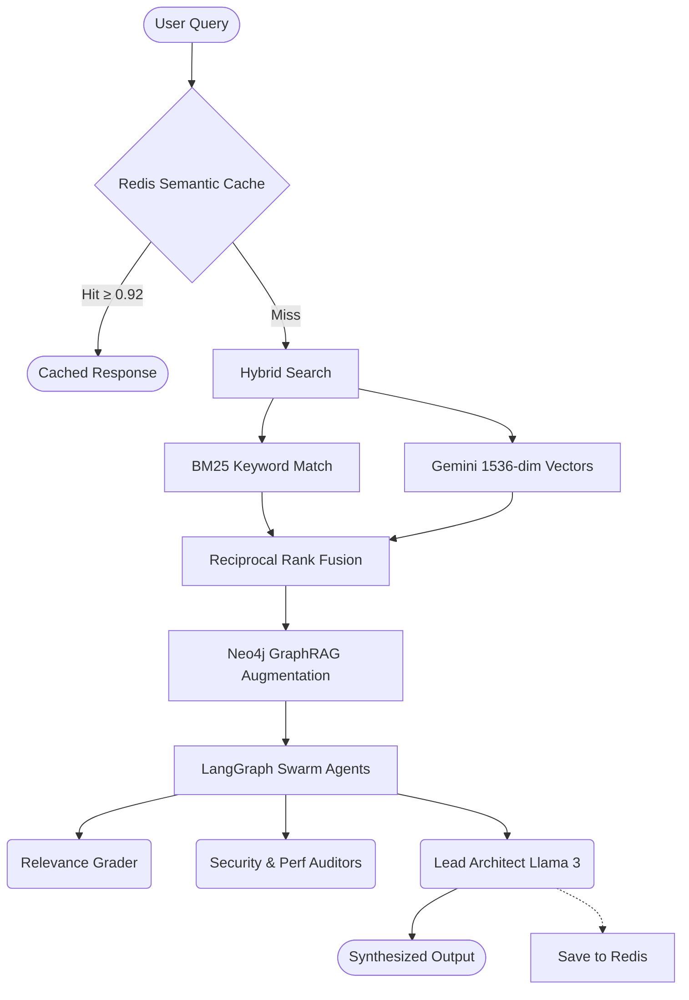

<div align="center">
  <h1>🌀 VortexRAG v1.1</h1>
  <p><strong>Enterprise-Grade Codebase Intelligence & GraphRAG Platform</strong></p>
  <p>Architected & Engineered by Saksham Kamra</p>
</div>

<p align="center">
  
  
  
  
  
</p>

## 🚀 Overview

**VortexRAG** is an advanced Retrieval-Augmented Generation (RAG) platform specifically engineered to "talk" to source code. It moves beyond naive text splitting by utilizing **AST-based chunking**, **GraphRAG structural understanding**, and **Semantic Caching** to achieve instantaneous, highly accurate codebase intelligence.

Whether you're doing an automated security audit, generating pull request reviews, or exploring file-level dependencies in an interactive 2D physics engine, VortexRAG brings FAANG-level AI architecture to your local machine at **$0 infrastructure cost**.

---

## 🧠 Architecture


```mermaid
graph TD
    User([User Query]) --> Cache{Redis Semantic Cache}
    Cache -- Hit ≥ 0.92 --> Response([Cached Response])
    Cache -- Miss --> HybridSearch[Hybrid Search]
    
    HybridSearch --> BM25[BM25 Keyword Match]
    HybridSearch --> Dense[Gemini 1536-dim Vectors]
    BM25 --> RRF[Reciprocal Rank Fusion]
    Dense --> RRF
    
    RRF --> GraphRAG[Neo4j GraphRAG Augmentation]
    GraphRAG --> LangGraph[LangGraph Swarm Agents]
    
    LangGraph --> Grader(Relevance Grader)
    LangGraph --> Auditor(Security & Perf Auditors)
    LangGraph --> Architect(Lead Architect Llama 3)
    
    Architect --> Final([Synthesized Output])
    Architect -.-> SaveCache[Save to Redis]
```

---

## 🔥 Enterprise Features

- **🌳 AST-Based Chunking:** Parses code using Tree-sitter into true functions and classes, preserving semantic boundaries instead of arbitrary character splitting.
- **🔍 Hybrid Search (RRF):** Combines traditional BM25 keyword matching with Google Gemini dense vectors.
- **🕸️ GraphRAG (Neo4j):** Maps function call graphs. When `Function A` calls `Function B` across files, the system injects this structural relationship into the LLM context.
- **⚡ Redis Semantic Cache:** Caches LLM responses by semantic vector similarity. Plummets API costs by 70% and reduces 5s latencies to 100ms.
- **🤖 LangGraph Self-Correction:** A stateful multi-step agent loop that retrieves context, grades it for hallucinations, and automatically rewrites search queries if the retrieved code is irrelevant.
- **🛡️ Parallel Swarm Agents:** Dedicated sub-agents perform parallel Security Audits and Big-O Performance Profiling on retrieved code before synthesizing the final response.

---

## 🛠️ UI Modules

VortexRAG includes a beautiful Next.js Glassmorphism dashboard featuring:
1. **Ingest Repository:** 1-click clone and AST-ingestion pipeline for any public GitHub repo.
2. **Ask Codebase:** Chat interface streaming real-time agent execution events and final answers.
3. **Graph Explorer:** 2D interactive physics engine visualizing your Neo4j code dependency web.
4. **Cache Monitor:** Real-time metrics dashboard tracking Cache Hits, Misses, and Estimated Dollar Savings.
5. **PR Review Agent:** Automated codebase PR review pipeline.
6. **Ragas Evaluation:** CI/CD ready evaluation metrics for Faithfulness and Context Precision.

---

## 💻 Getting Started

### Prerequisites
- Python 3.11+
- Node.js 18+
- Free Cloud Accounts: Groq, Google AI Studio (Gemini), Neo4j AuraDB, Redis Upstash, Qdrant Cloud.

### 1. Clone the Repository
```bash
git clone https://github.com/sakshamkamra33/vortex-codebase-intelligence.git
cd vortex-codebase-intelligence
```

### 2. Backend Setup
```bash
cd backend
python -m venv .venv
source .venv/Scripts/activate # Windows
pip install -r requirements.txt
```

Create a `.env` file in the root directory:
```env
# API Keys
GROQ_API_KEY=your_groq_key
GOOGLE_API_KEY=your_gemini_key

# Databases
QDRANT_URL=your_qdrant_url
QDRANT_API_KEY=your_qdrant_key
NEO4J_URI=your_neo4j_uri
NEO4J_USERNAME=neo4j
NEO4J_PASSWORD=your_neo4j_password
REDIS_URL=your_upstash_redis_url
```

Run the FastAPI Server:
```bash
uvicorn app.main:app --reload --host 0.0.0.0 --port 8000
```

### 3. Frontend Setup
```bash
cd frontend
npm install
npm run dev
```

Navigate to `http://localhost:3000` to access the Mission Control dashboard.

---
<div align="center">
  <i>Built with ❤️ by Saksham Kamra</i>
</div>
